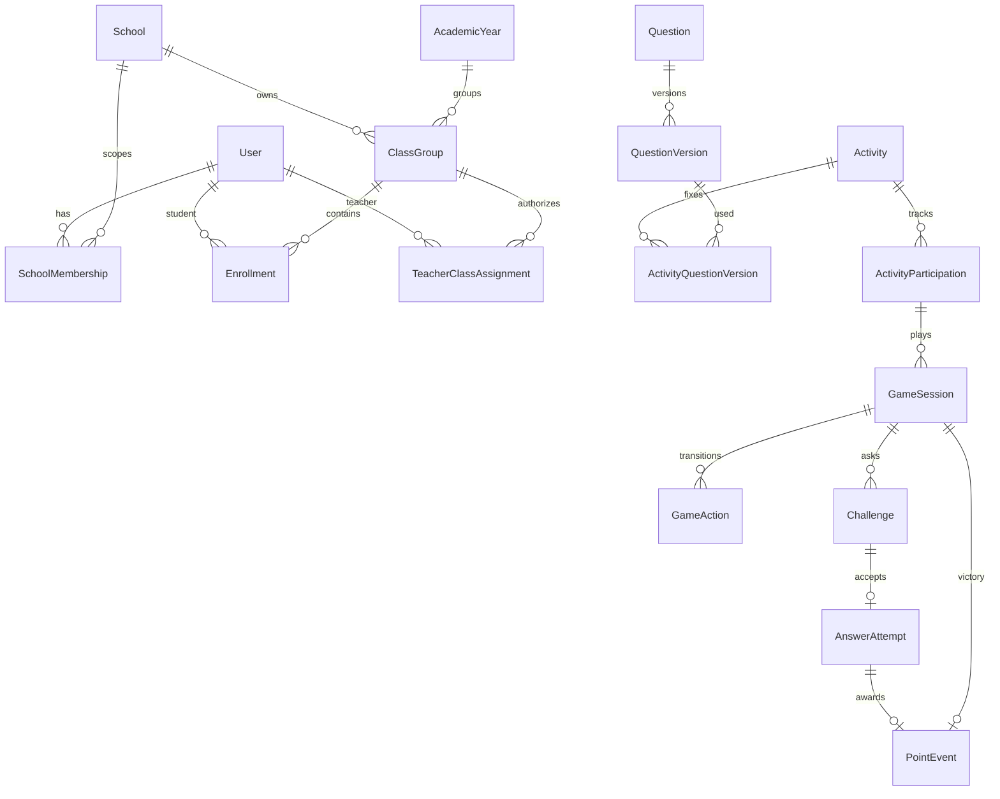

# Contrato de dados planejado

Este é contrato de planejamento; FM-003 inicia identidade/sessão/auditoria e cada tarefa adiciona
sua migration. IDs são UUID/CUID estáveis, datas `timestamptz`, valores enumerados validados. Exclusão
pedagógica é lógica (`status`, `endedAt`); eventos e respostas são imutáveis, salvo retificação
auditada.

## Identidade e escola

- `User(id,name,email?,studentCode?,passwordHash,status,globalRole,sessionVersion,createdAt)`; e-mail
  adulto e código aluno únicos por índices parciais/canônicos.
- `Session(id,userId,tokenHash,expiresAt,revokedAt,lastSeenAt)` e `PasswordReset(id,userId,
  tokenHash,expiresAt,usedAt,requestedById?)`; nunca armazenar token puro.
- `School(id,name,externalCode,status)`; `SchoolMembership(userId,schoolId,role,status,startsAt,
  endsAt)` único por período ativo compatível.
- `AcademicYear(id,schoolId,year,status)`; `ClassGroup(id,schoolId,academicYearId,grade,name,status)`
  único por escola/ano/nome; `Enrollment(studentId,classId,startsAt,endsAt,status)` e
  `TeacherClassAssignment(teacherId,classId,startsAt,endsAt,status)`.

## Conteúdo

- `Theme`, `Skill(grade,code,status)` e relação curricular versionável.
- `Question(id,ownerUserId?,origin,visibility,status)` é identidade; `QuestionVersion(id,
  questionId,version,grade,difficulty,type,prompt,explanation,numericExpected?,numericPolicy,
  publishedAt,contentHash)` é imutável após uso/publicação.
- `QuestionOption(id,versionId,key,text,isCorrect,displayOrder)`; gabarito nunca entra no DTO prévio.
- `QuestionMedia(id,versionId,type,url,mime,size,altText,audioOrder,status)`.
- `QuestionSubmission(id,sourceVersionId,submittedBy,status,reviewerId?,decisionAt?,notes?)`; aprovação
  cria `Question` SEMED + versão com `sourceVersionId`, preservando original.

## Atividade e jogo

- `Activity(id,schoolId,classId,teacherId,title,instructions,targetCount,status,revision,openedAt,
  closedAt)`; `ActivityQuestionVersion(activityId,questionVersionId)` fixa conteúdo.
- `ActivityParticipation(activityId,studentId,enrollmentId,status,acceptedAnswers,targetReachedAt,
  extraAnswers,revision)`.
- `GameSession(id,participationId,status,revision,turn,phase,errorStreak,studentPieces,machinePieces,
  winner,startedAt,suspendedAt,endedAt)`; no máximo uma ativa por participação.
- `GameAction(id,gameId,clientActionId,expectedRevision,type,dice,resultState,createdAt)` com unicidade
  `(gameId,clientActionId)`.
- `Challenge(id,gameId,actionId,questionVersionId,difficulty,status,sequenceId,createdAt)` e
  `AnswerAttempt(id,challengeId,studentId,rawNormalized,isCorrect,acceptedAt)` único por desafio.
- `PointEvent(id,studentId,classId,activityId,gameId,answerId?,type,amount,awardedAt)`; unicidades
  para `ANSWER_AWARD(answerId)` e `VICTORY_BONUS(gameId)`. Ranking agrega por `classId` e mês do
  servidor, não apaga eventos.

## Operação

`AuditEvent(actorId,action,targetType,targetId,schoolId?,before?,after?,correlationId,at)` guarda
mudanças administrativas sem segredos. `OperationalLog` não contém respostas individuais.

## Contexto histórico

Resposta congela enrollment, escola, turma, série, habilidade, dificuldade, versão, origem,
atividade e assistência de áudio do momento. Nome/situação atual podem mudar sem reescrever o fato.
Índices principais: vínculos ativos; atividade/turma/status; desafios pendentes; eventos
`(classId,awardedAt,studentId)`; respostas por aluno/habilidade/data; chaves de idempotência.
