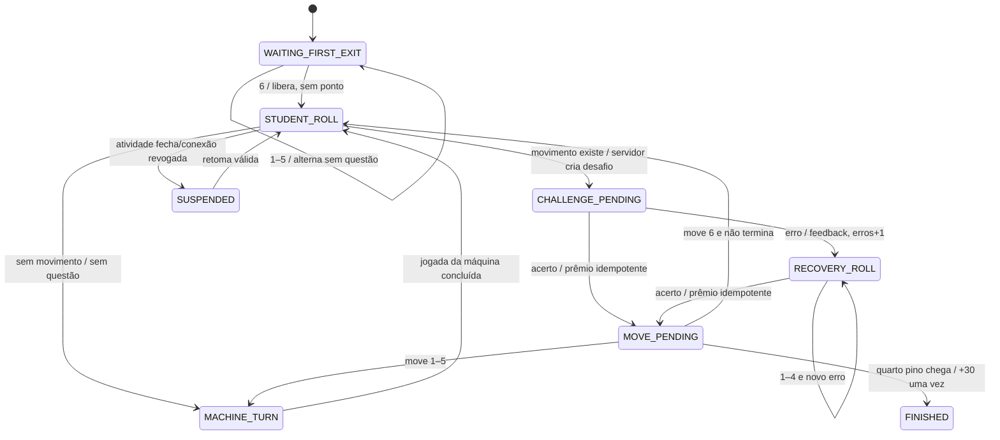

# Ludo, máquina de estados e pontuação

## Percurso

Cada lado tem base, entrada, 52 casas compartilhadas indexadas de forma canônica, corredor final de
6 posições e chegada. Um `BoardDefinition` versionado declara caminho de cada jogador e casas
seguras; estado persiste posição lógica (`BASE`, índice 0..57, `HOME`), nunca coordenada visual.
Exigir valor exato para `HOME` é P-LUDO-01 pendente. Quatro pinos por lado; sem barreiras no MVP.

## Estados

Se todos os pinos jogáveis voltam à base, `RECOVERY_RELEASE` usa dado 1–6 sem questão até liberar
um pino; contador de erros permanece (P-LUDO-02 pendente) e depois retorna a 1–4. Pino já em `HOME`
não conta como preso.

## Transições autorizadas

| Fase | Comando | Servidor valida | Resultado |
| --- | --- | --- | --- |
| roll | `clientActionId,revision` | sessão, atividade, turno, fase | sorteia dado; repete resposta no retry |
| create challenge | interno | movimento legal + conteúdo elegível | fixa versão/dificuldade; DTO sem gabarito |
| answer | resposta+actionId | desafio pendente e revisão | corrige/transaciona tentativa, meta e ponto |
| move | pieceId+actionId | acerto, dado e destino legal | persiste captura/turno/revisão; bônus se vencer |
| machine | interno | turno da máquina | prioridade: chegada, captura, saída, avanço; desempate por ID |
| resume | gameId | mesma participação e atividade aberta | DTO de estado atual; não zera sequência |

O cliente só anima o novo DTO. Duas abas/dispositivos compartilham uma partida ativa; revisão antiga
recebe 409+estado atual. Queda de conexão bloqueia comandos offline. Fechamento/revogação suspende.

## Questões e repetição

Depois da saída inicial, dado define dificuldade. Seleção filtra versões da atividade/série; evita
repetição imediata e marca repetição quando o conjunto se esgota. Cada erro fecha aquele desafio,
mostra gabarito/explicação permitidos e o próximo dado 1–4 cria outro desafio. Mudança de habilidade
é registrada e nunca chamada de recuperação daquela habilidade.

## Pontos

| erros na sequência | prêmio do acerto |
| ---: | ---: |
| 0 | 10 |
| 1 | 7 |
| 2 | 4 |
| 3+ | 1 |

Erro apenas incrementa; acerto cria `ANSWER_AWARD` único e encerra sequência. Movimento vencedor
cria `VICTORY_BONUS` único de 30 na mesma transação do encerramento. Meta atingida não muda valores.
`awardedAt` do servidor e `classId` histórico definem ranking; partida atravessando mês pode gerar
eventos em meses distintos.

## Pontos ainda não confirmados

Chegada exata, contador após retorno total, extra da máquina após 6, convivência de pinos, política
determinística e fuso/empates são propostas. FM-016 pode construir regras parametrizadas; FM-018/019
não são `prontas` até as decisões de alto impacto em [14](14-open-decisions.md).

O motor FM-016 representa as quatro alternativas de OD-002 em `LudoRules` e publica um preset
identificado como proposto. Chegada e convivência já alteram as transições do motor; jogada extra da
máquina e contador de recuperação ficam persistíveis na mesma configuração para consumo pelas
sessões futuras. Isso é suporte técnico às alternativas, não confirmação de produto.
